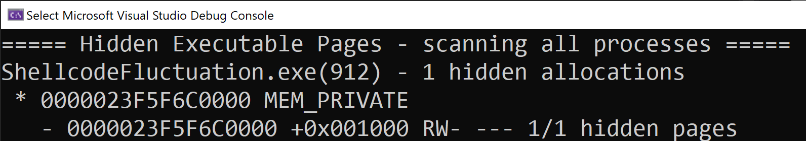

## Detection of hidden shellcode via CFG bitmap anomalies

1. Memory scanners can only reasonably scan executable memory regions.
1. The kernel memory manager only stores the original protection and the current protection in the Virtual Address Descriptor (VAD) tree.

[Gargoyle](https://lospi.net/security/assembly/c/cpp/developing/software/2017/03/04/gargoyle-memory-analysis-evasion.html) and similiar techniques use these facts and periodically toggle their memory protection to non-executable to hide from memory scanners.

However, [Gabriel Landau](https://twitter.com/GabrielLandau) observed that the Control Flow Guard (CFG) bitmap is only updated whenever a region is marked executable, and specifically that it is not updated when a region is marked non-executable. 
This means that the CFG bitmap (inadvertently) records the location of all private memory addresses that are, **or have previously been**, executable during the lifetime of the process.

This can be used to flag memory regions in CFG-enabled processes that have been changed from executable to non-executable. This makes protection fluctuation stand out beautifully in most host processes.

See [[Black Hat Asia 2023] You Can Run, but You Can't Hide - Finding the Footprints of Hidden Shellcode](https://www.blackhat.com/asia-23/briefings/schedule/index.html#you-can-run-but-you-cant-hide---finding-the-footprints-of-hidden-shellcode-31237) for more details.

#### Related Work
 * https://www.elastic.co/security-labs/get-injectedthreadex-detection-thread-creation-trampolines - detection of thread creation gadgets via CFG bitmap state
